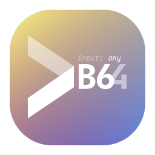
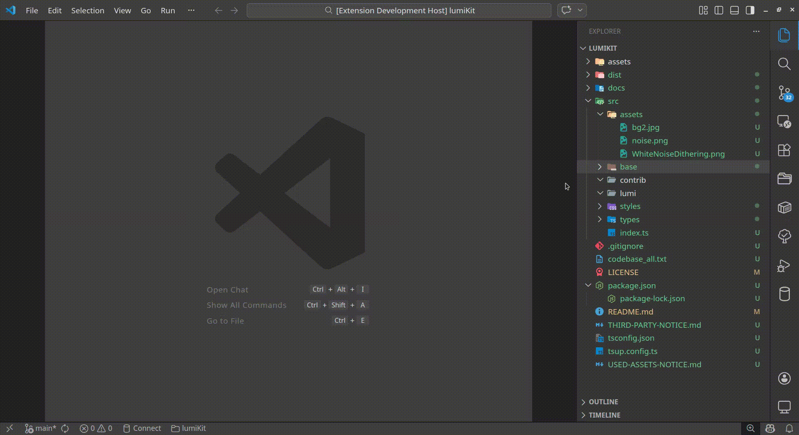
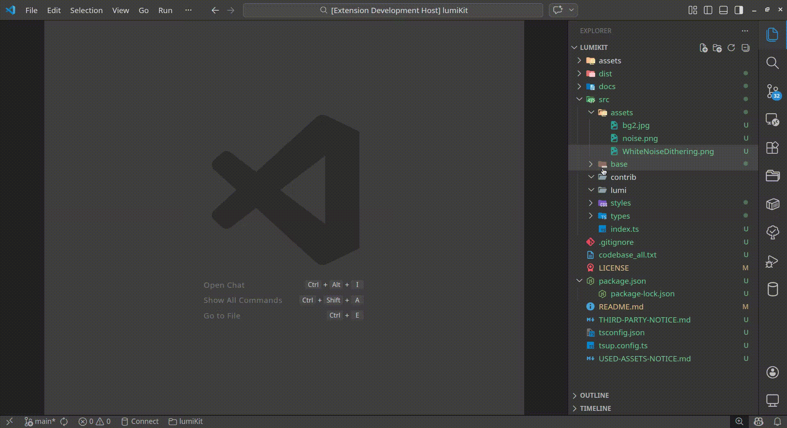

<p align="center">
  
</p>
<p align="center">
  <a href="https://img.shields.io/badge/version-0.1.0-blue?logo=visualstudiocode">
    
  </a>
  <a href="https://img.shields.io/badge/License-MIT-blue.svg">
    
  </a>
  <a href="https://img.shields.io/badge/VS%20Code-%5E1.109.0-007ACC?logo=visualstudiocode&logoColor=white">
    
  </a>
  <a href="https://img.shields.io/badge/Type-VS%20Code%20Extension-007ACC?logo=visualstudiocode">
    
  </a>
</p>

---

**to-base64** is a lightweight VS Code extension that encodes selected files to Base64 directly from the Explorer window. Perfect for embedding assets in code, preparing data for APIs, or creating portable text representations of binary files — all without leaving your editor.

---

## ✨ Features

| Feature                     | Description                                                                   |
| --------------------------- | ----------------------------------------------------------------------------- |
| 🖱️ **Explorer Integration** | Right-click any file(s) → **"Encode to Base64"**                              |
| 📁 **Multi-File Support**   | Select multiple files with `Ctrl`/`Cmd` and encode them in batch              |
| 🔐 **Binary-Safe**          | Handles images, executables, archives, and any file type correctly            |
| 🏷️ **Smart Naming**         | Output files use `filename_base64` pattern (no extension) to avoid overwrites |
| 📊 **Progress Feedback**    | Real-time notification progress bar with cancellation support                 |
| 🚫 **Skip Folders**         | Automatically filters out directories — only processes files                  |

---

## 📦 Installation

### From VS Code Marketplace (Coming Soon)

1. Open VS Code (`Ctrl+Shift+X`)
2. Search for **"to-base64"**
3. Click **Install**

### Manual Installation (`.vsix`)

1. Download the latest `.vsix` from [Releases](https://github.com/quadroc0rp/to-base64/releases)
2. In VS Code: `Ctrl+Shift+P` → **"Extensions: Install from VSIX..."**
3. Select the downloaded file

### Build from Source

```bash
# Clone the repository
git clone https://github.com/quadroc0rp/to-base64.git
cd to-base64

# Install dependencies
npm install

# Build the extension
npm run package

# Install locally
code --install-extension ./to-base64-0.1.0.vsix
```

---

## 🚀 Usage

### Basic Workflow

1. Open your project in VS Code
2. In the **Explorer** panel, select one or more files:
   - Single file: Click once
   - Multiple files: Hold `Ctrl` (Windows/Linux) or `Cmd` (Mac) while clicking
3. Trigger encoding via:
   - **Context Menu**: Right-click → **"Encode to Base64"**
   - **Keyboard**: `Ctrl+Alt+B` (`Cmd+Alt+B` on Mac) _(only when Explorer is focused)_
4. Wait for the progress notification to complete
5. Find new `*_base64` files in the same directory as originals

### 🎬 Demo

<p align="center">  <br/> <em>Encoding a single file via context menu</em> </p> <p align="center">  <br/> <em>Encoding multiple files in batch</em> </p>

### Output Format

Each encoded file contains a plain-text Base64 string (RFC 4648, no line breaks):

```base64
iVBORw0KGgoAAAANSUhEUgAAAAEAAAABCAYAAAAfFcSJAAAADUlEQVR42mNk+M9QDwADhgGAWjR9awAAAABJRU5ErkJggg==
```

| Original File | Output File      |
| ------------- | ---------------- |
| `logo.png`    | `logo_base64`    |
| `config.json` | `config_base64`  |
| `README`      | `README_base64`  |
| `archive.zip` | `archive_base64` |

> 💡 **Tip**: The `_base64` suffix + removed extension ensures original files are never overwritten, even if they lack an extension.

### Quick Examples

```bash
# Encode a single TypeScript file
# → Select src/app.ts → Right-click → "Encode to Base64"
# → Creates: src/app_base64

# Encode multiple assets at once
# → Select logo.png, icon.svg, banner.jpg (Ctrl+Click)
# → Run command → Creates: logo_base64, icon_base64, banner_base64

# Encode a binary file (e.g., PDF, EXE)
# → Works identically — Base64 output is safe for text-based transport
```

---

## ⚙️ Configuration

This extension currently has no configurable settings. All behavior is optimized for simplicity:

| Setting           | Default Value   | Description                      |
| ----------------- | --------------- | -------------------------------- |
| Output directory  | Same as source  | Where `*_base64` files are saved |
| Filename pattern  | `{name}_base64` | Prevents accidental overwrites   |
| Encoding standard | RFC 4648        | Standard Base64, UTF-8 safe      |

---

## 🛠️ Development

### Project Structure

```tree
to-base64/
├── src/
│   ├── extension.ts      # Command registration & activation
│   ├── processor.ts      # Core encoding logic + progress handling
│   ├── loader.ts         # File reading utilities (binary)
│   ├── writer.ts         # File writing + smart naming
│   ├── convertor.ts      # Base64 encoding (Buffer + js-base64 fallback)
│   └── test/
│       ├── fixtures/     # Test input/expected files
│       ├── convertor.test.ts
│       ├── processor.integration.test.ts
│       ├── writer.test.ts
│       └── utils.ts      # Test helpers
├── dist/                 # Bundled extension (generated)
├── out/                  # Compiled tests (generated)
├── docs/
│   └── icons/            # Additional icon sizes (not published)
├── package.json          # Extension manifest
├── tsconfig.json         # TypeScript configuration
├── esbuild.js            # Build bundler config
├── LICENSE               # MIT License
└── README.md             # This file
```

## 🗺️ Roadmap

| Feature                   | Status       | Version | Description                                                                                       |
| ------------------------- | ------------ | ------- | ------------------------------------------------------------------------------------------------- |
| Core Encoding             | ✅ Completed | v0.1.0  | Base64 encode files from Explorer                                                                 |
| Multi-File Support        | ✅ Completed | v0.1.0  | Batch process selected files                                                                      |
| Binary File Handling      | ✅ Completed | v0.1.0  | Safe encoding of images, archives, etc.                                                           |
| Progress Notifications    | ✅ Completed | v0.1.0  | Visual feedback with cancellation support                                                         |
| Smart Filename Generation | ✅ Completed | v0.1.0  | `file.base64` pattern prevents overwrites                                                         |
| Test Coverage             | ✅ Completed | v0.1.0  | Unit + integration tests with fixtures                                                            |
| **Planned Features**      |              |         |                                                                                                   |
| Custom Output Directory   | 📋 Planned   | v0.2.0  | Let users choose where `*.base64` files are saved. Static, and dynamic based on original filetype |
| Configurable Suffix       | 📋 Planned   | v0.2.0  | Change `.base64` to custom pattern via `settings.json`                                            |
| Copy to Clipboard Mode    | 📋 Planned   | v0.2.0  | Option to copy Base64 string instead of saving file                                               |
| Decode Command            | 📋 Planned   | v0.3.0  | Reverse operation: `*.base64` → original file                                                     |
| Line Wrapping Option      | 📋 Planned   | v0.2.0  | Format output with configurable line length (e.g., 76 chars)                                      |
| Workspace Trust Support   | 📋 Planned   | v0.2.0  | Graceful handling in untrusted workspaces                                                         |

> 💡 Have a feature request? [Open an issue](https://github.com/quadroc0rp/to-base64/issues)

---

## 🤝 Contributing

Contributions are welcome! This extension is designed to be simple and focused, but improvements are always appreciated.

### How to Contribute

1. Fork the repository
2. Create a feature branch
3. Make your changes (keep them focused and well-tested)
4. Run linting and tests: `npm run lint && npm run test`
5. Submit a Pull Request with a clear description

### Code Guidelines

- Follow existing TypeScript strict mode patterns
- Use VS Code API best practices
- Try to keep dependencies minimal (only `js-base64` currently)
- Update this README if adding user-facing features
- Add tests for new functionality

### Reporting Issues

Found a bug or have a suggestion? [Open an issue](https://github.com/quadroc0rp/to-base64/issues) with:

- Clear steps to reproduce (for bugs)
- VS Code version and OS
- Extension version (`to-base64@0.1.0`)
- Screenshots or logs if helpful

---

## 📜 License

This project is licensed under the MIT License.

```text
MIT License

Copyright (c) 2026 Tsupko Nikita "quadroc0rp" Romanovich

Permission is hereby granted, free of charge, to any person obtaining a copy
of this software and associated documentation files (the "Software"), to deal
in the Software without restriction, including without limitation the rights
to use, copy, modify, merge, publish, distribute, sublicense, and/or sell
copies of the Software, and to permit persons to whom the Software is
furnished to do so, subject to the following conditions:

The above copyright notice and this permission notice shall be included in all
copies or substantial portions of the Software.

THE SOFTWARE IS PROVIDED "AS IS", WITHOUT WARRANTY OF ANY KIND, EXPRESS OR
IMPLIED, INCLUDING BUT NOT LIMITED TO THE WARRANTIES OF MERCHANTABILITY,
FITNESS FOR A PARTICULAR PURPOSE AND NONINFRINGEMENT. IN NO EVENT SHALL THE
AUTHORS OR COPYRIGHT HOLDERS BE LIABLE FOR ANY CLAIM, DAMAGES OR OTHER
LIABILITY, WHETHER IN AN ACTION OF CONTRACT, TORT OR OTHERWISE, ARISING FROM,
OUT OF OR IN CONNECTION WITH THE SOFTWARE OR THE USE OR OTHER DEALINGS IN THE
SOFTWARE.
```

<p align="center">
Made with ❤️ for developers who need quick, reliable Base64 encoding inside VS Code<br/>
<a href="https://github.com/quadroc0rp/to-base64/issues">Report an issue</a> •
<a href="https://github.com/quadroc0rp/to-base64">View source</a> •
<a href="https://github.com/quadroc0rp/to-base64/releases">Releases</a>
</p>
